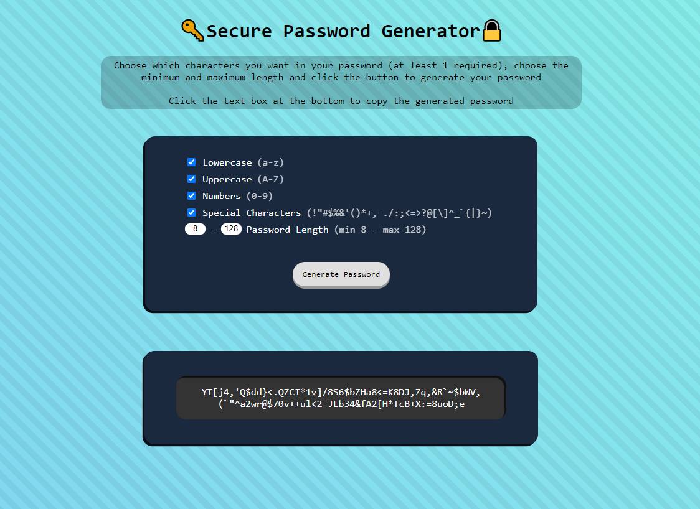

# Password Generator

## Table of Contents
1. [Description](#description)
2. [Usage](#usage)
3. [Visuals](#visuals)
4. [Resources](#resources)

## Description
This is a website I designed from scratch that allows the user to generate a password based on criteria chosen by the user. I used my background in javascript to create efficient and responsive code. I believe there is room for further optimization, and I may revisit this project for further improvement at a later date.

## Usage
- Use the checkboxes to select which character types you want in your generated password
- Enter the minimum and maximum length for your password
- Click the "Generate" button to generate your password
- Click on the generated password to copy the text to your clipboard

## Visuals

## Resources
- [Live Site](https://jthefox.github.io/password-generator/)
- [Online Repository](https://github.com/JtheFox/password-generator)
- [RandExp](https://github.com/fent/randexp.js)

## Future Updates
- Add criteria reset button
- Recommended password critiera & information about strong passwords
- Show password strength based on criteria
